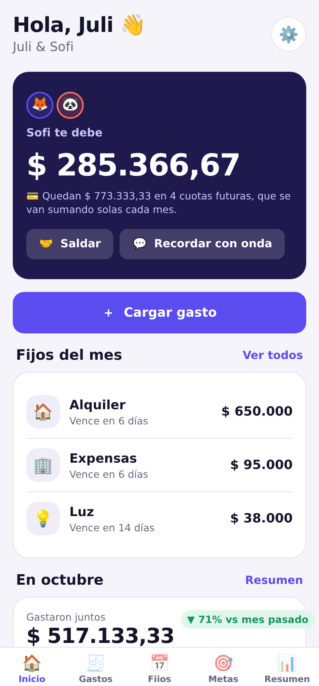
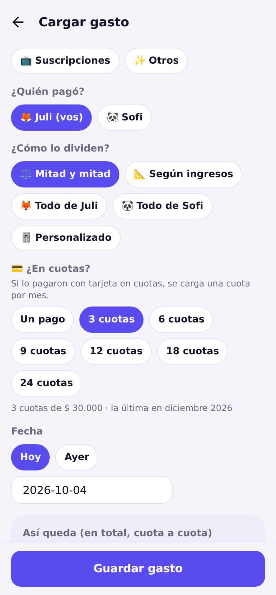
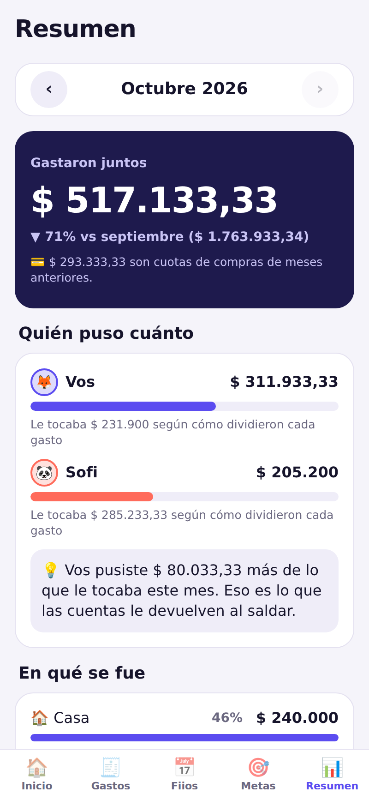

# Parejo 🟰

**Del “después te paso” al “estamos parejos”.**

App de finanzas compartidas para parejas (y deptos y viajes). Hace lo que hace Kesef, cada uno carga lo que paga y las cuentas se hacen solas, y además:

- 💳 **Cuotas que se reparten solas** mes a mes.
- 📅 **Fijos del mes** (alquiler, expensas, servicios) con vencimientos y quién paga.
- 📐 **División justa según ingresos**, además de mitad y mitad, todo de uno o porcentajes.
- 🎯 **Metas de ahorro en pareja** con ritmo mensual sugerido.
- 💵 **Pesos y dólares**.
- 🤝 **Saldar sin pelear:** mínimas transferencias, alias para copiar y un recordatorio amable para WhatsApp.
- 📊 **Resumen del mes:** en qué se fue la plata y cuánto puso cada uno.
- ☁️ **Juntos de verdad:** cuenta con código por email, invitación por link y sincronización en tiempo real (Supabase). Funciona sin conexión.
- 🎙️ **Carga por voz:** “15 lucas en el súper, pagó Sofi, en 3 cuotas”.
- 🏷️ **Etiquetas y presupuestos** por categoría, con avisos cuando se acercan al tope.
- ⭐ **Parejo Pro** (USD 35/año, 14 días gratis, Pro para los dos): Mercado Pago con pagos que entran solos, voz sin límite, insights detallados y exportación a Excel.
- 📲 **Web instalable (PWA)** lista para Vercel, mientras llega a las tiendas.

Una sola base de código para **web, Android e iOS** (Expo + React Native + Expo Router).

<p>
  
  
  
  
</p>

📄 Producto: [`docs/PRODUCTO.md`](docs/PRODUCTO.md) · ☁️ Sincronización: [`docs/SINCRONIZACION.md`](docs/SINCRONIZACION.md) · 🌐 Vercel, Pro y Mercado Pago: [`docs/VERCEL_Y_PRO.md`](docs/VERCEL_Y_PRO.md) · 🚀 Tiendas: [`docs/PUBLICAR.md`](docs/PUBLICAR.md)

## Correrla

```bash
npm install
cp .env.example .env.local   # datos de Supabase (opcional: sin esto funciona solo local)
npm run web                  # en el navegador
npm start                    # escaneá el QR con Expo Go (Android/iOS)
```

En la bienvenida tocá **“Probar con datos de ejemplo”** para ver la app con una pareja, gastos, cuotas, fijos y metas ya cargados.

## Chequeos

```bash
npm test           # lógica (saldos, cuotas, fijos, metas) y sincronización entre dos teléfonos
npm run typecheck
npm run lint
npm run check      # los tres juntos
npm run test:db    # SQL y políticas de seguridad, con un Postgres local (ver docs/SINCRONIZACION.md)
```

## Estructura

```
src/
  app/            Pantallas (Expo Router: cada archivo es una ruta)
    (tabs)/       Inicio, Gastos, Fijos, Metas, Resumen
    expense/      Cargar/editar gasto y detalle
    goal/, bill/  Metas y gastos fijos
    settle.tsx    Saldar cuentas
    settings.tsx  Ajustes, cuenta, personas, grupos
    login.tsx     Entrar con código por email
    join/         Unirse a un grupo con una invitación
    quick.tsx     Carga por voz o texto
    budgets.tsx   Presupuestos
    insights.tsx  Insights detallados (Pro)
    inbox.tsx     Pagos de Mercado Pago para revisar
    pro.tsx       Parejo Pro
    onboarding.tsx
  domain/         Lógica pura y testeada: tipos, plata, fechas, reparto, cuotas, saldos, resúmenes
  store/          Estado de la app (zustand) guardado en el dispositivo
  sync/           Sincronización: motor, cola de cambios, conexión a Supabase, login e invitaciones
  pro/            Plan Pro (prueba, límites, checkout) y bandeja de Mercado Pago
  features/       Componentes con lógica de negocio (selector de división, filas de gastos, textos)
  ui/             Sistema de diseño: tema claro/oscuro, textos, tarjetas, botones, chips
api/              Funciones de Vercel: suscripción, webhook y conexión con Mercado Pago
public/           Manifest, íconos y service worker de la web instalable
supabase/         Migraciones SQL (tablas, seguridad, funciones) y sus pruebas
docs/             Producto, hoja de ruta y guía de publicación
```

### Decisiones clave
- **Montos en centavos enteros** y reparto por el método del resto mayor: nunca se pierde ni se inventa un centavo.
- **Las cuotas se imputan por mes:** el saldo de hoy solo incluye cuotas hasta el mes actual. Las futuras se muestran aparte.
- **Datos locales primero:** la app funciona sin internet. Los cambios se encolan y se suben solos; lo que carga la otra persona llega en tiempo real.
